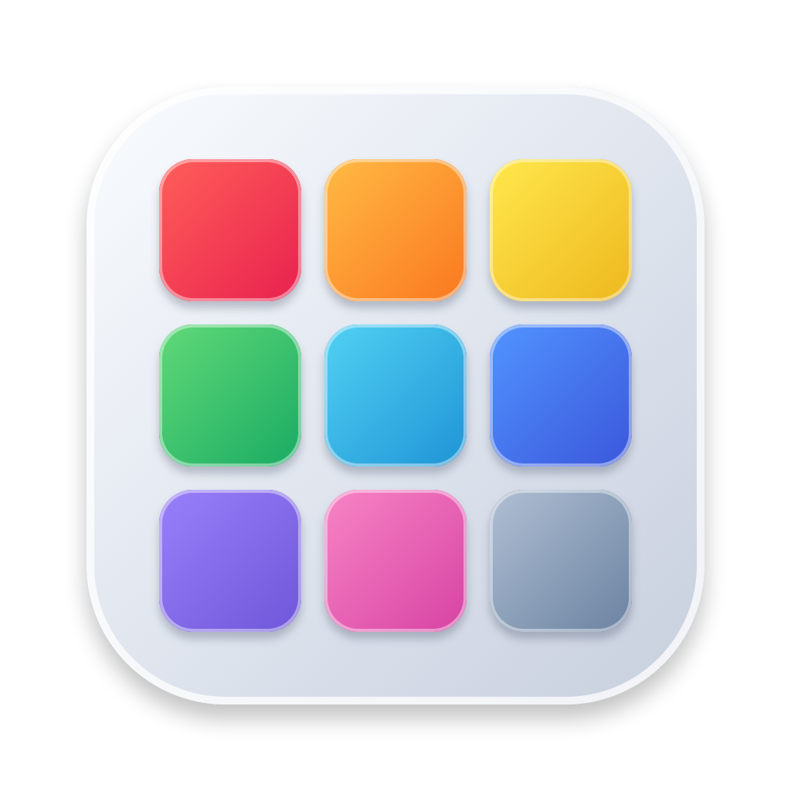
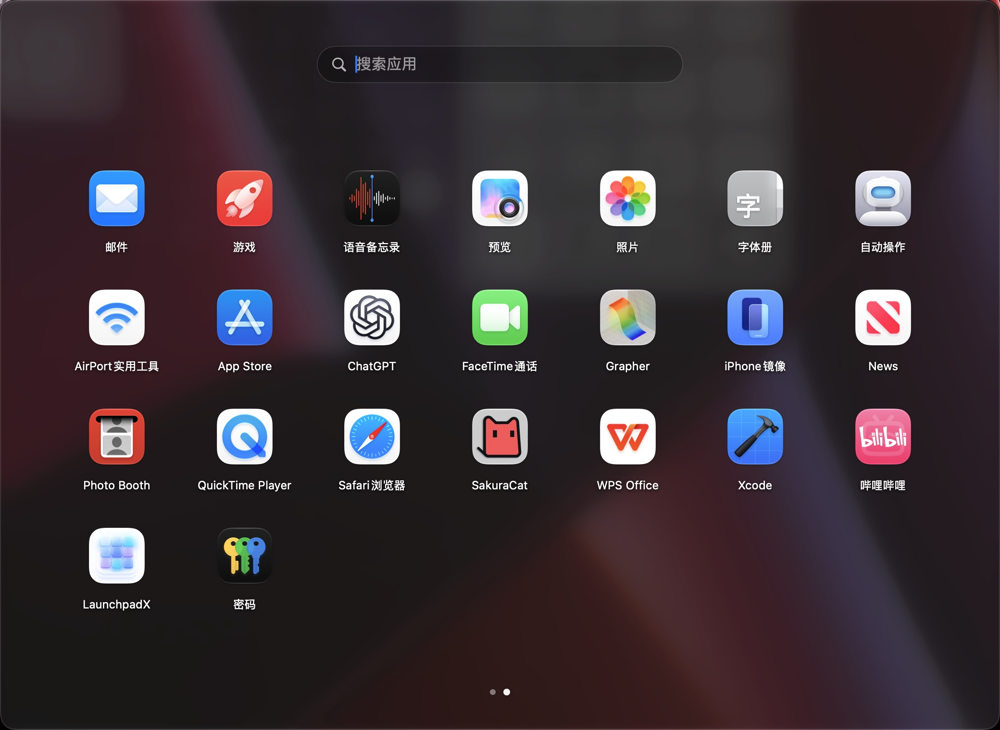

# LaunchpadX

<p align="center">
  
</p>

<p align="center">
  <strong>为 macOS 打造的原生应用启动台</strong><br>
  A native, customizable app launcher for macOS
</p>

<p align="center">
  
  
  <a href="LICENSE"></a>
</p>

LaunchpadX is an open-source macOS launcher built with SwiftUI and AppKit. It brings back a fast, familiar app grid with folders, search, gestures, and both full-screen and resizable window modes.

LaunchpadX 是一款使用 SwiftUI 和 AppKit 开发的 macOS 开源启动器。它提供熟悉的应用网格、文件夹和快速搜索，并支持全屏与可调整大小的窗口模式。

<p align="center">
  
</p>

**Development build:** 1.0 (Build 44) · **License:** GPL-3.0 · **Minimum system:** macOS 26

> This repository does not currently publish signed, notarized release binaries. Build the app with Xcode to try it.

## Features

- **Two presentation modes:** a full-screen launcher or a resizable standard window, with a dark Liquid Glass appearance.
- **Flexible app grid:** switch between paged and vertically scrolling layouts; adjust icon size, rows, columns, and display selection.
- **Fast search:** find apps by name, alias, bundle identifier, pinyin, or pinyin initials.
- **Folders and editing:** long-press to edit, drag to reorder apps, create folders, and move apps in or out of folders.
- **App management:** rename or hide apps, add scan locations, select apps in batches, and move supported apps to Trash after confirmation.
- **Shortcuts and gestures:** configure the global launch shortcut, page controls, trackpad swipes, F4, and optional hot corners.
- **Menu bar and Dock:** choose how LaunchpadX appears in macOS and optionally start it at login.
- **LaunchOS layout import:** optionally import matching app order, aliases, hidden state, and folders from the local LaunchOS database. The source data is read-only and retained.
- **Low-overhead scanning:** monitor app directories for changes and refresh the index in the background.

## Requirements

- macOS 26 or later
- Xcode 26 or later

## Build and run

```bash
git clone https://github.com/prometheus-lumen/MAC-LAUNCHPADX.git
cd MAC-LAUNCHPADX
open LaunchpadX.xcodeproj
```

Choose the `LaunchpadX` scheme in Xcode and run it. To build from Terminal:

```bash
xcodebuild build \
  -project LaunchpadX.xcodeproj \
  -scheme LaunchpadX \
  -configuration Release \
  -destination 'platform=macOS'
```

## Notes

- The default launcher shortcut is `⌥ Space`. Change it in Settings if it conflicts with another app or system shortcut.
- Core launching and global shortcuts do not require Accessibility access. Optional hot-corner features may request it when enabled.
- App Sandbox is disabled so the launcher can discover apps in system locations, monitor app folders, and read app icons. This project is distributed for local use and open-source builds, not through the Mac App Store.
- The included tests cover search, layout persistence, folders, gestures, app discovery, and UI interactions.

## Project structure

```text
LaunchpadX/
├── App/                    # App entry point and dependency setup
├── Domain/                 # Launcher models
├── Features/
│   ├── Launcher/           # Grid, search, folders, drag and gestures
│   └── Settings/           # Settings and shortcut recording
├── Persistence/            # SwiftData models, layout repository and importer
├── Services/                # Discovery, search, shortcuts and monitoring
├── Shared/                  # Shared styles and design values
└── Window/                  # AppKit windows and panels

LaunchpadXTests/             # Unit tests
LaunchpadXUITests/           # UI tests
Scripts/                     # Icon generation and DMG packaging
docs/images/                 # Project screenshots
```

## Contributing

Issues and pull requests are welcome. Please keep changes focused and include reproduction steps for bug reports.

## License

LaunchpadX is distributed under the [GNU General Public License v3.0](LICENSE).
